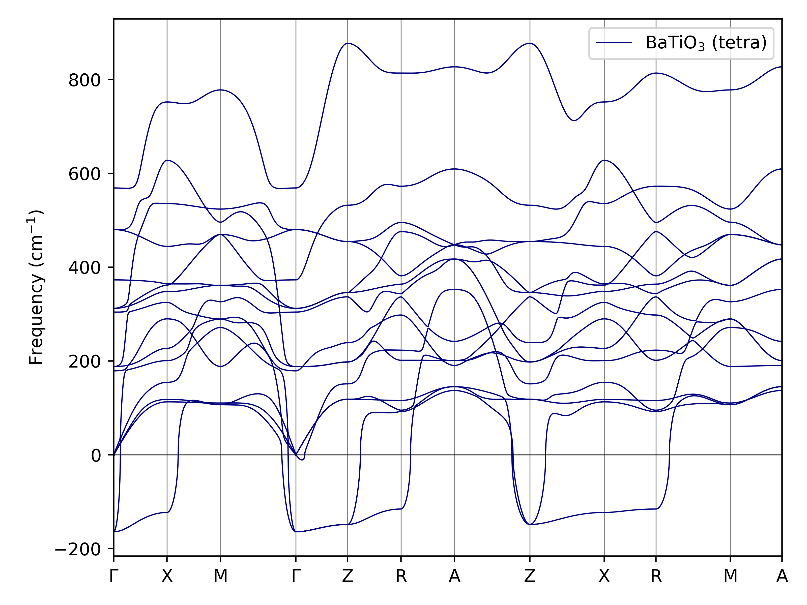
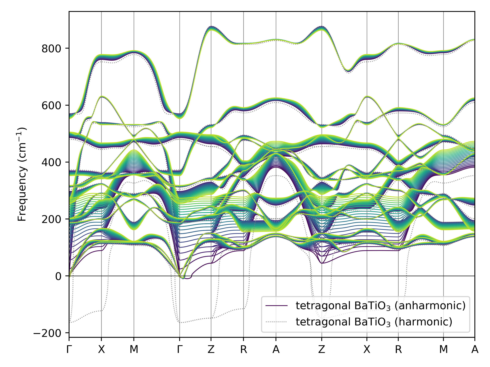
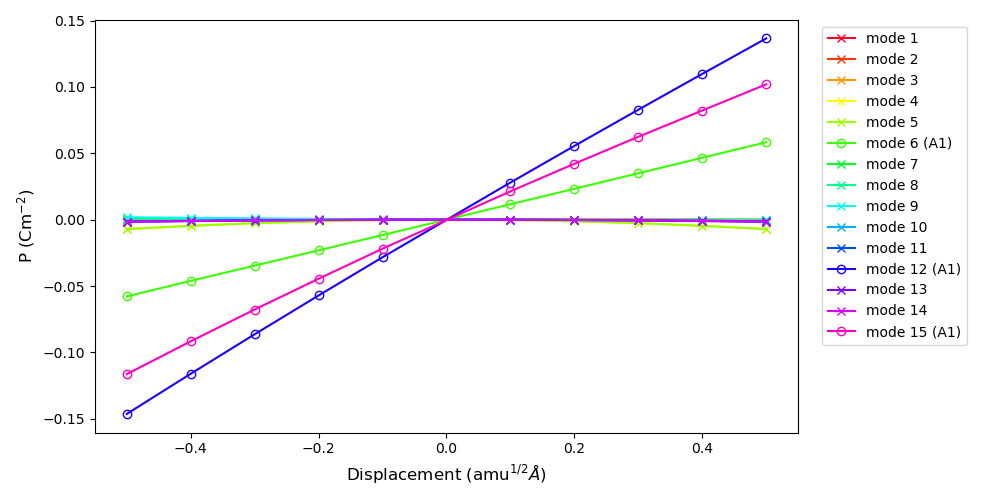
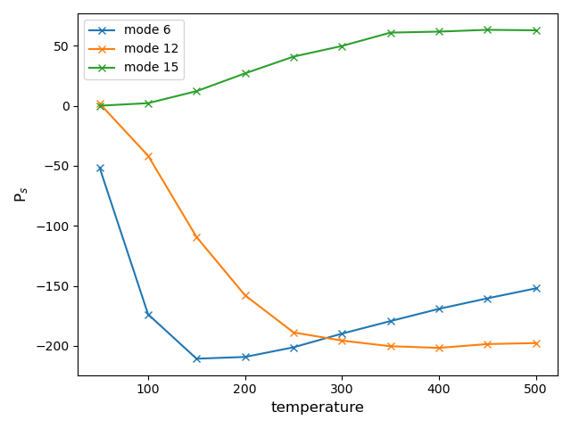

# How to use the pyro3.py script

This tutorial gives a walk-through on calculating the temperature and mode dependent pyroelectric constants of BaTiO3 using CRYSTAL23 and Alamode. It can be applied to most tetragonal, orthorhombic, and rhombohedral systems.

__Prerequisites:__

- .cif file of the optimized crystal structure
- Harmonic frequency calculation at $\Gamma$-point from CRYSTAL

The script is generally run by calling it in the command line and calling a __step__ with or without __options__ and possible additional parameters. In general the following command with options are available:

- `-s` select the step of the calculation; available: build, disp/displace, extr/extract, plt/plot and evec
- `-opt` select different options for some the steps disp, extr, and plt; available: harm/harmonic, anharm/anharmonic, pes, pyro, and pyrpa/'pyro a'/'pyro automatic'
- `-p` prefix that sets the _PREFIX_ attribute in the Alamode inputs or the labels for the lines of the (an)harmonic phonon dispersion plots
- `-cif` name of the .cif file containing the optimized crystal structure
- `-d` dimension of the supercell to be build; can be 3 (diagonal matrix given) or 9 integers (full matrix given)
- `-std` select whether the crystal structure should be standardized; available: 'prim' for primitive or 'crys' for crystallographic unit cell
- `-fn` set filenames for the Alamode input files
- `-mag` set the magnitude of the (an)harmonic displacements
- `-nd` set the number of random displacements to be created
- `-temp` temperatures for which the calculations should be done
- `-mode` modes for which the calculations should be done
- `-flip` set to `True` to flip the signs of the eigenvector
- `-crySys` select the crystal class to handle transformation between the primitive and crystallographic cell; available: rhomb, orthoA, and orthoC
- `-q` q values for which displacements are generated along the potential energy surface (PES)
- `-ks` select the source for the k-path in reciprocal space; available: ase and seeKpath
- `-cont` select whether the k-path should be calculated continuous

The following files need to be copied to one directory and the script _pyro3.py_ needs to be made executable:

- `ASE_Aalmode_interface.py`
- `ASE_CRYSTAL_interface.py`
- `cif2ALM.py`
- `cif2ANPHON.py`
- `cif2D12.py`
- `plottingFunctions.py`
- `pyro3.py`

## Step 1: build the cell and supercell for displacements

Phonon properties are calculated for supercells of the crystallographic or primitive unit cell. To make sure that the calculated polarization will align with the crystal structures real-space orientation along the _x_, _y_, and _z_ Cartesian axes, it is recommended to build supercells for all compounds with non-primitive crystallographic cells. If not set specifically, standard file names and prefixes are used for all Alamode input files, CRYSTAL input files cannot be given any individual names.

__Prerequisites:__

Create a new folder with the .cif file of the optimized structure of BaTiO3 and make sure the `pyro3.py´ script and its class and method scripts are installed properly. 

The first step uses the .cif file to build the supercell that is used for the displacements. By default the script does __not__ standardize the crystal structure and builds a __3x3x3__ supercell.

__Arguments that need to be set:__

`-s` set the step option to `build`

`-cif` name of the .cif file

__Arguments that can be set additionally:__

`-dim` dimension of the supercell (default 3x3x3); dimensions of the supercell can be set as either diagonal `[X Y Z]` or `[[X1 Y1 Z1],[X2 Y2 Z2],[X3 Y3 Z3]]` full matrix

`-std` the crystal structure can be standardized via `spg-lib` before creating the supercell (default ''); the structure can be standardized as either primitive (`prim`) or crystallographic (`crys`) unit cell

`-fn` the filename for the Alamode alm file can be set (default `ALM0.in`)

`-pf` the _PREFIX_ command in the alm file can be set (default empirical chemical formula given by ase)

To build a 3x3x3 supercell of tetragonal BaTiO$_3$ for which the structure has been standardized type the following into the command line:

    pyro3.py -s build -cif tetra_BaTiO3_opt.cif -dim 3 3 3 -std prim -pf BTO_tetra

This will create two json files containing the cell and supercell, a `pyroCalc_progress` object which saves certain parameters that have been set and lastly a file `ALM0.in` which can be run with `alm` in the command line:

    alm ALM0.in > ALM0.log

This will generate the file `BTO_tetra.pattern_HARMONIC` containing the harmonic displacement pattern, which is based on the symmetry of the crystal structure. 

> If one would want to calculate phonon properties for a structure with a non-orthorhombic primitive cell, it is advised to standardize the structure to the crystallographic cell. This will ensure proper alignment of the calculated spontaneous polarization with the Cartesian axes. See the [Supporting information](add Link here) to our paper for more information on this.

## Step 2: Generate the input files for the harmonic displacements

The generated pattern file in Step 1 will now be used to generate CRYSTAL inputs for the harmonic displacements.

__Arguments that need to be set:__

`-s` set the step option to `disp` for displacements

`-opt` set the step option to `harm` for harmonic

__Arguments that can be set additionally:__

`-mag` sets the magnitude of the displacement (default 0.02 Å)

In our case we want to generate displacements with 0.02 Å magnitude. The script will look for a file `CRY_TEMP` that includes all CRYSTAL parameters starting from _ENDGEOM_. If it can't find a comment line will be added instead. Use the following bash command:

    pyro3.py -s disp -opt harm

For tetragonal BaTiO3 the displacement pattern generates 13 displacements, for which the .d12 inputs and .ext external geometries are created, named `h\_disp1.d12` to `h\_disp13.d12`. Please run the _GRADCAL_ force calculations for each of them and do not rename them.

## Step 3: Extract and fit the first order force constants

If all forces have been calculated with CRYSTAL, we can extract them using the script. This writes the `DFSET_harmonic` file that is read by Alamode to fit the first order force constants. From the files crystal produces, you will need the .out files.

__Arguments that need to be set:__

`-s` set the step option to `extr` for force extraction

`-opt` set the step option to `harm` for harmonic

__Arguments that can be set additionally:__

`-fn` the filename for the Alamode alm and anphon files can be set (default `ALM1.in` and `phband.in`)

`-pf` the _PREFIX_ command in the alm file can be set (default empirical chemical formula given by ase)

`-std` set whether the crystallographic (`crys`) or primitive cell (`prim`) should be used for the anphon inputs

`-ks` set which k-point source should be used to sample the reciprocal space (default ase)

`-cont` sets whether the k-path is calculated continuously, adding additional paths between break or with said breaks (default `True`)

To extract the forces use the following command in the console:

	pyro3.py -s extr -opt harm

This will generate the `DFSET_harmonic` file, that can be read by Alamode. Run the `ALM1.in` and `phband.in` files:

	alm ALM1.in > ALM1.log
	anphon phband.in > phband.log

The first will give you the .xml file containing the fitted first order forces. The second will produce a .bands file, which contains the harmonic phonon dispersion. It can be plotted using the `-plt` option of the script. For plotting these general options are available:

__Arguments that need to be set:__

`-s` set the step option to `plt` for plotting

`-opt` set the step option to `harm` for harmonic

__Arguments that can be set additionally:__

`-p` set the prefix of the label for the harmonic phonon dispersion in the plot (default based on empirical chemical formula given by ase)

Running the following command in the console

	pyro3.py -s plt -opt harm -p 'BaTiO3 (tetra)'

will produce the following plot

> Note: The script has a built-in method to convert plain text chemical formulas to the right format. Changes (e.g. 2+/3-) will be set to superscript and numbers in the formular will be set as subscript.

## Step 4: Generate the input files for the anharmonic displacements

To fit forces of second and third order, a second set of displacements need to be calculated, called random displacements. While for the displacement pattern only single atoms are displaced in the cell, for the random displacements each atom is displaced by a vector of the length equal to the `-mag` parameter, but random composition thereof along the Cartesian _x_, _y_, and _z_-axes.

__Arguments that need to be set:__

`-s` set the step option to `disp` for displacements

`-opt` set the step option to `anharm` for anharmonic

__Arguments that can be set additionally:__

`-mag` sets the magnitude of the displacement (default 0.02 Å)

`-nd` sets how many displacements are created (default 40)

We use the following command in the console:

	pyro3.py -s disp -opt anharm -mag 0.04 -nd 40

For tetragonal BaTiO3 usually 40 random displacements with a magnitude of 0.04 Å are enough for a proper convergence of the self-consistent phonon calculations. Other systems might require (additional) displacements of smaller or larger displacements for convergence, thus some trial and error might be needed.

This will create 40 inputs (a `CRY_TEMP` file can again complete the inputs), for which again the _GRADCAL_ calculations need to be run with CRYSTAL.

> Each time the `-s disp -opt anharm` step is called, a new set of randomized displacements is generated. The script will give you a warning, if the current folder already contains an object called `random_displacements`. It will give you the option to overwrite or add them. If you type `n` or `no`, the new set of displacements will be added to the existing one, if you type `y` or `yes` the existing displacements will be overwritten. __Once displacements are replaced, they can't be retrieved!__

## Step 5: Extract and fit second and third order force constants

Forces are again extracted, this time generating the `DFSET_random` file. From the files crystal produces, you will need the .out files.

__Arguments that need to be set:__

`-s` set the step option to `extr` for force extraction

`-opt` set the step option to `anharm` for anharmonic

The same optional arguments can be set as in Step 3. If you have a compound with non-orthogonal unit cell, for which the force calculations have been done for the crystallographic cell, the `-std` option should be set to `crys`. Otherwise the phonon eigenvectors might be a bit off. The default filenames are `ALM2.in`, `ALM3.in`, and `scph.in`, the _PREFIXES_ are based on the empirical chemical formula given by ase plus an extension of _\_cubic_ and _\_quartic_ for the alm files and _\_scph_bands_ for the anphon file. The self-consistent phonon (SHPH) calculations will be carried out for a temperature range of 0K to 1000K in steps of 50K with the default settings of the script, but those parameters can be changed as needed.

To extract the forces use the following command in the console:

	pyro3.py -s extr -opt anharm

Run the `ALM2.in`, `ALM3.in`, and `phband.in` files:

	alm ALM2.in > ALM2.log
	alm ALM3.in > ALM3.log
	anphon scph.in > scph.log

> Depending on the setup it is advised to submit the `ALM3.in` and `scph.in` to the queue since they require more memory and CPU time.

> For non-orthogonal systems it is also advised to change the anphon parameter _KMESH_ to a value equal or multiple of the supercell size. This seems to improve the SCPH calculation convergence and also helps with properly separating the different eigenvectors for the subsequent steps.

The anphon calculation will produce a .scph_bands file, which can be plotted with:

	pyro3.py -s plt -opt anharm

producing the following plot:

The same optional arguments as in step 3 are available. If some of the steps in the SCPH do not converge properly or if only certain temperatures shall be plotted, the `-temp` option of the script can be set, followed by the desired temperatures. 

## Step 6: Extract the phonon eigenvectors

From the optimized forces one can extract the phonon eigenvectors for the different temperatures calculated in the SCPH calculation. Therefore the first step is to generated the temperature dependent .xml files and anphon inputs. For an easier file management it is advised to create a new folder for this step. Copy the .xml file containing the harmonic forces as well as the .scph_dfc2 file produced by the self-consistent phonon calculations. The cell and supercell files also need to be copied, while the `pyroCalc_progress` object and `calc_documentation.txt` are optional.

__Arguments that need to be set:__

`-s` set the step option to `evec` to extract eigenvectors

`-temp` set the temperatures for which the eigenvectors should be extracted

__Arguments that can be set additionally:__

`-std` set whether the crystallographic (`crys`) or primitive cell (`prim`) should be used for the anphon inputs

> Choose `-std crys` if the steps beforehand have been done for the crystallographic cell of your compound.

If the dfc2 package of Alamode is set up correctly it will call the `dfc2` tool and extract one `compoundName_TEMP.xml` file for each temperature set. For each temperature one `evecTEMP.in` file will be created.

To extract the eigenvectors for 50 to 500 K use the following command in the console:

	pyro3.py -s evec -temp 50 100 150 200 250 300 350 400 450 500

Then run all anphon .in files:

	anphon evec50.in > evec50.log
	:
	:
	anphon evec500.in > evec500.log

This will produce .evec files, containing the eigenvectors of the different temperatures along the reciprocal space path.

> Usually the reciprocal path starts at the origin ($\Gamma$-point) and therefore only the first set of eigenvectors is of interest for us. In case the reciprocal path given by ase or seeKpath (or a manually set one) for the previous step does __not__ start at $\Gamma$, please change the path here to one that starts with it. The script by default only loads the very first eigenvector in the following steps, therefore errors could emerge.

## Step 7: Temperature specific pyro displacements

Again it is advised to create a new folder for the following steps. This time they should contain the optimized .cif file and the eigenvector .evec files.

__Prerequisites for non-orthogonal primitive cells:__

No matter the supercell dimension and basis (primitive or crystallographic cell) the eigenvectors are only calculated for the primitive cell by Alamode. Therefore we need to create a new cell and supercell for the following steps. Therefore, to build a 1x1x1 supercell of tetragonal BaTiO3, standardized to the primitive cell, type the following command in the console:

    pyro3.py -s build -cif tetra_BaTiO3_opt.cif -dim 1 1 1 -std prim

> It should be mentioned, that the following steps are generally done for the unit cell, not the supercell as in the previous steps. Since the eigenvectors are limited to the primitive cell, only transformation of the displaced structure to the crystallographic cell may be needed for proper alignment of the spontaneous polarization. If the eigenvectors are giving "jumpy" values over the temperature range this could be caused by 1. inconsistent signs of the eigenvectors or 2. branching of the spontaneous polarization. While the former can easily be fixed by flipping the vector (`-flip True`) the latter can be avoided by using supercells for the polarization calculation. Although we have not observed any branching for properly converged SCPH calculations in our systems.

> If you still want to use supercell for the following calculations they can always be build in the following steps by adding the `-dim X Y Z` option to the console commands.

__Remarks regarding the eigenvectors:__

The eigenvectors of the phonon frequencies should in general show the symmetry of the irreducible representations of the space group. For our tetragonal BaTiO3 the underlying space group is based on the _C4v_ point group. Further on are only eigenvectors of the totally symmetric representation $A_{(1)(g)}$ of interest for calculating the temperature dependent pyroelectric coefficients. The CRYSTAL frequency calculation reports the irreducible representations of each mode and thus as a first step the frequency and phonon eigenvectors can be compared. For easy cases the absolute directions of both should be fairly identical. 

Since the displacements are directly linked to the eigenvectors (multiplied by a temperature factor), the "net" displacement along the cartesian _x_, _y_, and _z_-axes should also be directly linked to degree of freedom the mode's irreducible representations posses. Therefore this script sums the _x_, _y_, and _z_ contributions up individually for each eigenvector, to determine the symmetry of the eigenvector. This option is shown in more detail in section 7.3. The very basic idea is that the summed up "net" displacement should have one main component according to the degree of freedom (e.g. if the main component is along _z_, the irreducible representation of the mode should be $A_1$) or none along _x_, _y_, and _z_ if it corresponds to one of the modes without linear function (e.g. $A_2$ or $B_2$ for tetragonal BaTiO3). The direction of the mode is determined by the sign of the "net" displacement. Since for us the modes are aligned along the _-z_ direction, modes will be flipped if the main contribution is along _+z_. The sign of the eigenvector in general decides which sign the pyroelectric coefficient will have, thus in general both directions of the vector give valid results. But for comparability they should be aligned to show the same sign.

For each temperature two displacements at $T\pm 20$ are generated. With those the pyroelectric coefficient $p_z$ at temperature $T$ can be calculated from the difference in spontaneous polarization $\Delta P$ of the two displacements:

$$
p_z = \frac{\Delta P}{\Delta T} = \frac{P_2 - P_1}{T_2 - T_1}
$$

### Step 7.1: Potential Energy Surface displacements

Displacements along the Potential Energy Surface (PES) can give further insight which phonon modes are relevant for the pyroelectric coefficient. Since the Cartesian _z_ direction aligns with the totally symmetric irreducible representation, only modes of $A_1$ symmetry contribute to the overall pyroelectric coefficient. Thus when displaced with a certain magnitude along the PES only modes of $A_1$ symmetry should show a non-zero slope for the displacement. So this step acts as a second control step, to evaluate how good the convergence of the SCPH calculations was. 

The displacements are usually done for one temperature (e.g. room temperature or any $T$ where the compound is stable). The magnitude of the displacement is set by the `q` value, which can be set as list of [start, end, step] in units of angstrom.

__Arguments that need to be set:__

`-s` set the step option to `disp` for displacements

`-opt` set the option to `pes` for potential energy surface

`-temp` set the temperature for which the eigenvectors shall be used

`-mode` set the modes for which the displacements shall be generated

__Arguments that can be set additionally:__

`-crySys` used to transform the primitive cell to the crystallographic cell of the crystal system, options `orthoA`/orthoC` for orthorhombic (A or C centered) systems or `rhomb` for rhombohedral systems (default: `tetra`)

`-dim` in case supercells shall be used instead of the unit cell, the supercell dimension can be set here with 3 or 9 numbers

`-q` q-values for the displacement [q_min, q_max, q_step] (default: [-0.5, 0.5, 0.1])

To displace all modes at 300 K along the PES between -0.5 and 0.5 in steps of 0.1 use the following command in the console:

	pyro3.py -s disp -opt pes -temp 300 -mode 1 2 3 4 5 6 7 8 9 10 11 12 13 14 15

> If a file called `CRY_TEMP_PYRO` is located in the folder, the inputs will be completed automatically. The _GRADCAL_ line from the previous template can be omitted, since this step does not require force calculation. Further on should the _SHRINK_ factors be adjusted if the calculation is done for the unit cell.

All .d12 (first) and .d3 (after) calculations need to be run with CRYSTAL to generate the wave functions and .polari files. For obtaining the values for the spontaneous polarization for the PES displacement please continue to step 8.1.

### Step 7.2: Temperature dependent pyro displacements

Although only eigenvectors of $A_1$ symmetry are relevant for the pyroelectric properties, the script can displace any mode for any temperature for which eigenvectors are available in any combination.

__Arguments that need to be set:__

`-s` set the step option to `disp` for displacements

`-opt` set the option to `pyro` for pyro displacement

`-temp` set the temperature for which the eigenvectors shall be used

`-mode` set the modes for which the displacements shall be generated

__Arguments that can be set additionally:__

`-crySys` used to transform the primitive cell to the crystallographic cell of the crystal system, options `orthoA`/orthoC` for orthorhombic (A or C centered) systems or `rhomb` for rhombohedral systems (default: `tetra`)

`-dim` in case supercells shall be used instead of the unit cell, the supercell dimension can be set here with 3 or 9 numbers

`-flip` if set to `True` it flips the sign of the eigenvector

>As mentioned before, the sign and mode number of the eigenvectors may not be consistent over the SCPH calculation temperature range, therefore manual flipping of the eigenvectors may be needed. If only the totally symmetric $A_1$ modes are of interest, the "automatic pyro displacement" option should be chosen, since it will select the modes along the Cartesian _z_-axis as well as align the modes along the _-z_-direction. It will also handle potential switching of modes at different temperatures.

For tetragonal BaTiO3 three $A_1$ modes are present. Assuming all modes have the correct sign and do not change their position with rising temperature, use the following command in the console to generate the inputs for the modes 6, 12, and 15 between 50 and 500 K:

	pyro3.py -s disp -opt pyro -mode 6 12 15 -temp 50 100 150 200 250 300 350 400 450 500

All .d12 (first) and .d3 (after) calculations need to be run with CRYSTAL to generate the wave functions and .polari files. For obtaining the values for the spontaneous polarization for the pyro displacement please continue to step 8.2.

### Step 7.3: Automatic option for the temperature dependent pyro displacements

As mentioned in the general section of step 7, does a set of properly converged eigenvectors show the symmetry of the irreducible representation when summed up over the _x_, _y_, and _z_ contributions. Therefore the option `pyroa`/`"pyro automatic"` will first analyze the symmetry of the eigenvectors and then displace the relevant $A_1$ modes along _-z_. Doing so, three .txt files will be generated:

- `evecProp.txt` gives a table how the eigenvectors propagate over the different temperatures
- `evecPol.txt` gives a table with the possible polarization for each mode by giving the direction (_x_, _y_, or _z_) and the value of the summed up net-displacement along that axis. If the line is empty the modes are of a symmetry without degree of freedom along the Cartesian axes. If there is a "-" in front of the direction it shows that the original eigenvector needs to be flipped to align with right direction
- `dispPattern.txt` gives a table that shows which modes were displaced for which temperature. A "-" in front of the number shows, that the eigenvector has been flipped.

These files will be used to automatically create all relevant pyro displacements of the $A_1$ modes. The translational modes (usually modes 1-3 if no imaginary frequencies are present) are also included in the analysis, although the calculation can usually be neglected since the polarization generated by those is usually 0.

__Arguments that need to be set:__

`-s` set the step option to `disp` for displacements

`-opt` set the option to `pyroa` for potential energy surface

`-temp` set the temperature for which the eigenvectors shall be used

__Arguments that can be set additionally:__

`-crySys` used to transform the primitive cell to the crystallographic cell of the crystal system, options `orthoA`/orthoC` for orthorhombic (A or C centered) systems or `rhomb` for rhombohedral systems (default: `tetra`)

`-dim` in case supercells shall be used instead of the unit cell, the supercell dimension can be set here with 3 or 9 numbers

For tetragonal BaTiO3 three $A_1$ modes are present. Using the automatic option in the console command will produce the same inputs for the modes 6, 12, and 15 between 50 and 500 K as in step 7.2:

	pyro3.py -s disp -opt pyroa -temp 50 100 150 200 250 300 350 400 450 500

It will also generate inputs for the translational mode along Cartesian _z_, but the calculation can either be left out or run as another check to see if the SCPH has properly separated the translational eigenvectors. All .d12 (first) and .d3 (after) calculations need to be run with CRYSTAL to generate the wave functions and .polari files. For obtaining the values for the spontaneous polarization for the automatic pyro displacement please continue to step 8.3.

## Step 8: Spontaneous polarization calculation

The pyroelectric coefficient $p_z$ at each temperature $T$ is then calculated from the difference in spontaneous polarization of the two displacements:

$$
p_z = \frac{\Delta P}{\Delta T} = \frac{P_2 - P_1}{T_2 - T_1}
$$

Where $T_1$ and $T_2$ are the two temperatures $T+20K$ and $T-20K$ of the initial temperature $T$ and $P_1$ and $P_2$ are their spontaneous polarizations. The polarizations themself are calculated using the Berry phase approach implemented in CRYSTAL.

For the spontaneous polarization property inputs including the _SPOLBP_ keyword need to be created for each temperature and mode investigated.

### Step 8.1: For the Potential Energy Surface displacements

Since the displacements along the potential energy surface are done for a constant temperature ($T_1 = T_2$), but varying magnitude of the eigenvectors, the initial state for the difference is the bare eigenvector without multiplying it with a length factor.

__Arguments that need to be set:__

`-s` set the step option to `extr` for generating the _SPOLBP_ files

`-opt` set the option to `pes` for potential energy surface

`-temp` set the temperature for which the eigenvectors shall be used

`-mode` set the modes for which the displacements shall be generated

__Arguments that can be set additionally:__

`-q` q-values for the displacement [q_min, q_max, q_step] (default: [-0.5, 0.5, 0.1])

>The `q` values need to be the same as for the previous step.

To generate files for all modes at 300 K along the PES between -0.5 and 0.5 in steps of 0.1 use the following command in the console:

	pyro3.py -s extr -opt pes -temp 300 -mode 1 2 3 4 5 6 7 8 9 10 11 12 13 14 15

If the property calculation is done for the (crystallographic or primitive) unit cell, it finishes fast. Thus, a `subprocess()` function immediately runs the calculation. This can be disabled by commenting out this line in the script, but then the calculations need to be submitted separately. The values of the spontaneous polarization along the Cartesian axes can be found at the end of the .prop.out files.

### Step 8.2: For the temperature dependent pyro displacements

Here the calculation of the spontaneous polarization from the two different displacements with $T+20K$ and $T-20K$ is straight forward.

__Arguments that need to be set:__

`-s` set the step option to `extr` for generating the _SPOLBP_ files

`-opt` set the option to `pyro` for pyro displacements

`-temp` set the temperature for which the eigenvectors shall be used

`-mode` set the modes for which the displacements shall be generated

__Arguments that can be set additionally:__

`-flip` if set to `True` it will look for files that have the extension `_flip` in their file name

For tetragonal BaTiO3 three $A_1$ modes are present. Use the following command in the console to generate the inputs for the modes 6, 12, and 15 between 50 and 500 K:

	pyro3.py -s extr -opt pyro -mode 6 12 15 -temp 50 100 150 200 250 300 350 400 450 500

If the property calculation is done for the (crystallographic or primitive) unit cell, it finishes fast. Thus, a `subprocess()` function immediately runs the calculation. This can be disabled by commenting out this line in the script, but then the calculations need to be submitted separately. The values of the spontaneous polarization along the Cartesian axes can be found at the end of the .prop.out files.

### Step 8.3: For automatic option for the temperature dependent pyro displacements

Generally this option does the same as the general extraction step for temperature dependent pyro displacements, just that the modes are selected automatically.

__Arguments that need to be set:__

`-s` set the step option to `extr` for generating the _SPOLBP_ files

`-opt` set the option to `pyroa` for automatic pyro displacements

`-temp` set the temperature for which the eigenvectors shall be used

For tetragonal BaTiO3 three $A_1$ modes are present. The following command in the console should generate the same inputs for the modes 6, 12, and 15 between 50 and 500 K as step 8.2:

	pyro3.py -s extr -opt pyroa -temp 50 100 150 200 250 300 350 400 450 500

>If the translational modes (usually modes 1-3) were not calculated, there might be some error message, but it can be just ignored.

If the property calculation is done for the (crystallographic or primitive) unit cell, it finishes fast. Thus, a `subprocess()` function immediately runs the calculation. This can be disabled by commenting out this line in the script, but then the calculations need to be submitted separately. The values of the spontaneous polarization along the Cartesian axes can be found at the end of the .prop.out files.

## Step 9: Plotting of the pyroelectric coefficients

The pyroelectric coefficients can then be calculated from the values of the spontaneous polarization along Cartesian direction _z_. The values in the .prop.out files are therefore divided by 40 ($\Delta T$) and converted to $\mu$Cm$^{-2}$K$^{-1}$. 

### Step 9.1: Potential Energy Surface displacements

Here the spontaneous polarization values are plotted directly. 

__Arguments that need to be set:__

`-s` set the step option to `plt` for plotting

`-opt` set the option to `pes` for potential energy surface

`-temp` set the temperature

`-mode` set the modes for which the values shall be plotted

The following line in the console should produce the plot below:

	pyro3.py -s plt -opt pes -temp 300 -mode 1 2 3 4 5 6 7 8 9 10 11 12 13 14 15

As can be seen, only the lines for modes 6, 12, and 15 show a non-zero slope. This confirms, that these eigenvectors are of $A_1$ symmetry and thus the only relevant pyro-active modes.

### Step 9.2 & 9.3: Plotting of the pyroelectric coefficients

Whether the pyro displacements were generated individually or automatically, the plotting step is the same. As a small prerequisite the .prop.out files might need some renaming, since the script expects continuous modes over the whole temperature range. If a mode switches position at some point, the files will be named after the new modes. But the `evecProp.txt` file should provide the right information to rename all files properly.

__Arguments that need to be set:__

`-s` set the step option to `plt` for plotting

`-opt` set the option to `pes` for potential energy surface

`-temp` set the temperature

`-mode` set the modes for which the values shall be plotted

The following line in the console should produce the plot below:

	pyro3.py -s plt -opt pyro -mode 6 12 15 -temp 50 100 150 200 250 300 350 400 450 500

>If data point seem to jump for one mode between positive and negative values the eigenvectors might not have been flipped. As a side note it should be mentioned, that flipped and unflipped eigenvectors will not produce values for the pyroelectric coefficients as X and -X. Since pyroelectric compounds have a net polarization, there might be a difference between the positive and negative coefficients. So just taking absolute values might still result in some small jumps between temperatures.

-----------------------------------------------------

           /\       /\ 
          /  \_____/  \      .
         . :::     ::: .    .:.
        : ::O::: :::O:: :  .:::.
        :  :::  o  :::  : .......
        mmm          mmm   ..... 
    ---------------------------------

